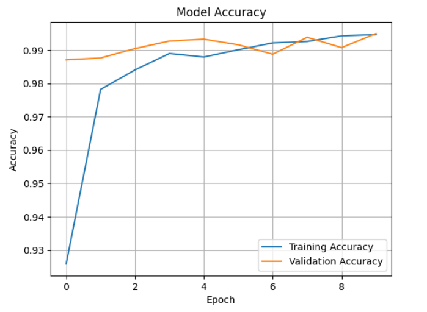
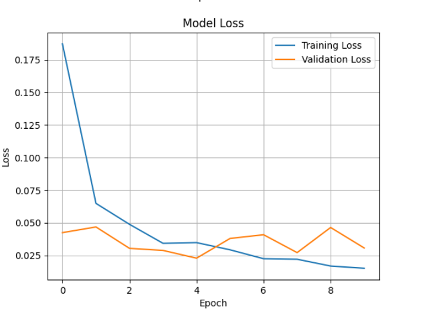

# Vehicle Detection Using CNN

This project performs binary image classification using Convolutional Neural Networks (CNNs) to detect whether an image contains a **vehicle** or **not**.

---

## Dataset

The dataset used in this project is publicly available on Kaggle:

🔗 [Vehicle Detection Image Set](https://www.kaggle.com/datasets/brsdincer/vehicle-detection-image-set/data)

**Important:** You must download the dataset manually from Kaggle and place the contents as follows:

```
data/
├── vehicles/
│   ├── img1.png
│   ├── img2.png
│   └── ...
├── non-vehicles/
    ├── img1.png
    ├── img2.png
    └── ...
```

---

## Technologies Used

- Python
- TensorFlow / Keras
- Matplotlib
- NumPy

---

## How to Run

1. Clone the repository or download the code files.
2. Download the dataset from Kaggle and place it under the `data/` directory as shown above.
3. Run the notebook to train the CNN model.

---

## Model Performance

The CNN model achieved over **99% validation accuracy** after 10 epochs of training.

### Training Accuracy and Loss Plots

#### Accuracy Plot



#### Loss Plot



---

## License

This project is licensed under the **MIT License**.

```
MIT License

Copyright (c) 2025

Permission is hereby granted, free of charge, to any person obtaining a copy
of this software and associated documentation files (the "Software"), to deal
in the Software without restriction...
```

---

## 🙌 Acknowledgements

Thanks to [Bariş Dincer](https://www.kaggle.com/brsdincer) for sharing the dataset on Kaggle.
